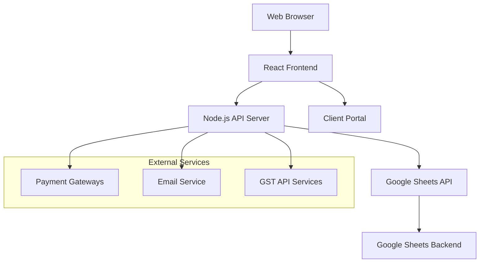

# Design Document

## Overview

The Project cum Invoice Management System is a web-based application designed for solopreneurs to manage projects, track time, generate invoices, and handle client relationships. The system uses Google Sheets as its backend database, providing users with direct access to their data while maintaining a professional web interface.

The architecture follows a modern web application pattern with a React-based frontend, Node.js backend API, and Google Sheets integration for data persistence. The system emphasizes simplicity, reliability, and compliance with Indian GST requirements.

## Architecture

### High-Level Architecture



### Technology Stack

**Frontend:**
- React.js with TypeScript for type safety
- Material-UI or Tailwind CSS for responsive design
- React Router for navigation
- Axios for API communication
- Chart.js for data visualization

**Backend:**
- Node.js with Express.js framework
- TypeScript for type safety
- Google Sheets API v4 for data operations
- JWT for authentication
- Nodemailer for email notifications

**Data Storage:**
- Google Sheets as primary database
- Multiple sheets for data organization
- Google Drive API for file storage

**External Integrations:**
- Payment gateways (Stripe, PayPal, Razorpay)
- GST API for Indian compliance
- Email service (SendGrid or similar)

## Components and Interfaces

### Frontend Components

#### 1. Dashboard Component
- **Purpose:** Main landing page showing key metrics and recent activities
- **Features:** Project overview, pending invoices, recent payments, quick actions
- **Data Sources:** Projects sheet, Invoices sheet, Payments sheet

#### 2. Project Management Components
- **ProjectList:** Display all projects with filtering and sorting
- **ProjectDetail:** Individual project view with tasks and time tracking
- **TaskBoard:** Kanban-style task management
- **TimeTracker:** Timer and manual time entry interface

#### 3. Invoice Management Components
- **InvoiceGenerator:** Create and customize invoices
- **InvoiceList:** View all invoices with status tracking
- **PaymentTracker:** Monitor payment status and send reminders

#### 4. Client Management Components
- **ClientList:** Manage client database
- **ClientPortal:** Secure client access to project information
- **ClientCommunication:** Chat and comment system

#### 5. Reporting Components
- **FinancialReports:** Profit/loss, expense tracking
- **ProjectReports:** Progress and completion analytics
- **Dashboard Analytics:** Visual charts and metrics

### Backend API Endpoints

#### Authentication Endpoints
```
POST /api/auth/login
POST /api/auth/logout
POST /api/auth/refresh
GET /api/auth/profile
```

#### Project Management Endpoints
```
GET /api/projects
POST /api/projects
PUT /api/projects/:id
DELETE /api/projects/:id
GET /api/projects/:id/tasks
POST /api/projects/:id/tasks
PUT /api/tasks/:id
DELETE /api/tasks/:id
```

#### Invoice Management Endpoints
```
GET /api/invoices
POST /api/invoices
PUT /api/invoices/:id
POST /api/invoices/:id/send
POST /api/invoices/:id/payment
GET /api/invoices/:id/pdf
```

#### Client Management Endpoints
```
GET /api/clients
POST /api/clients
PUT /api/clients/:id
DELETE /api/clients/:id
GET /api/clients/:id/projects
```

#### Reporting Endpoints
```
GET /api/reports/financial
GET /api/reports/projects
GET /api/reports/dashboard
```

## Data Models

### Google Sheets Structure

The system will use a single Google Sheets document with multiple sheets:

#### 1. Projects Sheet
| Column | Type | Description |
|--------|------|-------------|
| id | String | Unique project identifier |
| name | String | Project name |
| client_id | String | Reference to client |
| status | String | active/completed/on-hold |
| start_date | Date | Project start date |
| end_date | Date | Project deadline |
| budget | Number | Project budget |
| description | Text | Project description |
| created_at | DateTime | Creation timestamp |
| updated_at | DateTime | Last update timestamp |

#### 2. Tasks Sheet
| Column | Type | Description |
|--------|------|-------------|
| id | String | Unique task identifier |
| project_id | String | Reference to project |
| title | String | Task title |
| description | Text | Task description |
| status | String | todo/in-progress/completed |
| priority | String | low/medium/high |
| due_date | Date | Task deadline |
| estimated_hours | Number | Estimated time |
| actual_hours | Number | Actual time spent |
| created_at | DateTime | Creation timestamp |

#### 3. Clients Sheet
| Column | Type | Description |
|--------|------|-------------|
| id | String | Unique client identifier |
| name | String | Client name |
| email | String | Client email |
| phone | String | Client phone |
| address | Text | Client address |
| gstin | String | GST identification number |
| payment_terms | String | Payment terms |
| created_at | DateTime | Creation timestamp |

#### 4. Invoices Sheet
| Column | Type | Description |
|--------|------|-------------|
| id | String | Unique invoice identifier |
| invoice_number | String | Invoice number |
| client_id | String | Reference to client |
| project_id | String | Reference to project |
| amount | Number | Invoice amount |
| tax_amount | Number | Tax amount |
| total_amount | Number | Total amount |
| status | String | draft/sent/paid/overdue |
| due_date | Date | Payment due date |
| created_at | DateTime | Creation timestamp |

#### 5. Time_Entries Sheet
| Column | Type | Description |
|--------|------|-------------|
| id | String | Unique entry identifier |
| task_id | String | Reference to task |
| project_id | String | Reference to project |
| hours | Number | Hours worked |
| description | Text | Work description |
| date | Date | Work date |
| created_at | DateTime | Creation timestamp |

#### 6. Expenses Sheet
| Column | Type | Description |
|--------|------|-------------|
| id | String | Unique expense identifier |
| project_id | String | Reference to project |
| category | String | Expense category |
| amount | Number | Expense amount |
| description | Text | Expense description |
| date | Date | Expense date |
| receipt_url | String | Receipt file URL |

### Data Access Layer

#### Google Sheets Service
```typescript
interface SheetsService {
  // Generic CRUD operations
  create(sheetName: string, data: any): Promise<string>
  read(sheetName: string, id?: string): Promise<any[]>
  update(sheetName: string, id: string, data: any): Promise<boolean>
  delete(sheetName: string, id: string): Promise<boolean>
  
  // Batch operations
  batchCreate(sheetName: string, data: any[]): Promise<string[]>
  batchUpdate(sheetName: string, updates: any[]): Promise<boolean>
  
  // Query operations
  query(sheetName: string, filters: any): Promise<any[]>
  aggregate(sheetName: string, operation: string, field: string): Promise<number>
}
```

## Error Handling

### API Error Responses
```typescript
interface ApiError {
  code: string
  message: string
  details?: any
  timestamp: string
}
```

### Error Categories
1. **Authentication Errors (401):** Invalid credentials, expired tokens
2. **Authorization Errors (403):** Insufficient permissions
3. **Validation Errors (400):** Invalid input data
4. **Google Sheets API Errors (502):** External service failures
5. **Business Logic Errors (422):** Invalid business operations

### Error Handling Strategy
- Implement retry logic for Google Sheets API calls
- Graceful degradation when external services are unavailable
- User-friendly error messages in the frontend
- Comprehensive error logging for debugging

## Testing Strategy

### Unit Testing
- **Frontend:** Jest and React Testing Library for component testing
- **Backend:** Jest for API endpoint and service testing
- **Coverage Target:** 80% code coverage minimum

### Integration Testing
- Google Sheets API integration tests
- Payment gateway integration tests
- Email service integration tests
- End-to-end API workflow tests

### End-to-End Testing
- Cypress for critical user journeys
- Test scenarios:
  - Complete project lifecycle (create → tasks → invoice → payment)
  - Client portal access and functionality
  - Invoice generation and payment processing
  - Report generation and data export

### Performance Testing
- Google Sheets API rate limit handling
- Large dataset performance (1000+ projects/invoices)
- Concurrent user access testing
- Mobile device performance testing

## Security Considerations

### Authentication and Authorization
- JWT-based authentication with refresh tokens
- Google OAuth 2.0 for Google Sheets access
- Role-based access control (admin/client)
- Session management and timeout handling

### Data Security
- HTTPS enforcement for all communications
- Input validation and sanitization
- SQL injection prevention (though using Sheets API)
- XSS protection in frontend
- CSRF protection for state-changing operations

### Google Sheets Security
- Service account authentication for backend access
- Proper scope limitation for Google Sheets API
- Data encryption in transit
- Access logging and monitoring

## Performance Optimization

### Frontend Optimization
- Code splitting and lazy loading
- Component memoization for expensive operations
- Virtual scrolling for large lists
- Image optimization and caching

### Backend Optimization
- Google Sheets API request batching
- Caching frequently accessed data
- Database query optimization
- Response compression

### Google Sheets Optimization
- Minimize API calls through batching
- Implement local caching with TTL
- Use range-based operations for efficiency
- Implement pagination for large datasets

## Deployment Architecture

### Development Environment
- Local development with Google Sheets test document
- Environment variables for API keys and configuration
- Hot reloading for rapid development

### Production Environment
- Cloud hosting (Vercel, Netlify, or AWS)
- Environment-specific Google Sheets documents
- CDN for static assets
- SSL certificate and domain configuration

### CI/CD Pipeline
- Automated testing on pull requests
- Deployment automation
- Environment promotion workflow
- Rollback capabilities

## Compliance and Localization

### Indian GST Compliance
- GST calculation engine
- HSN/SAC code support
- E-invoice generation capability
- GST return report generation

### Data Localization
- Indian data residency requirements
- Google Sheets data location considerations
- Compliance documentation and auditing

This design provides a solid foundation for building a comprehensive project and invoice management system using Google Sheets as the backend, while maintaining professional functionality and user experience.