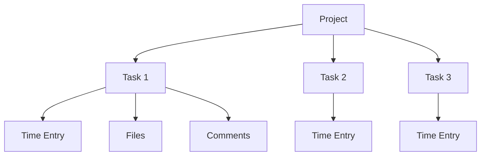
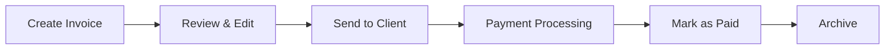
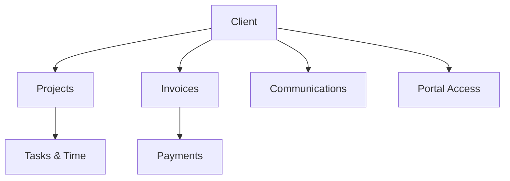

# User Guide Overview

This comprehensive user guide covers all aspects of the Project & Invoice Management System. Whether you're a new user getting started or an experienced user looking for advanced features, this guide has you covered.

## Guide Structure

### 🚀 Getting Started
- [Initial Setup](../getting-started.md)
- [Business Configuration](./business-setup.md)
- [First Project Creation](./first-project.md)

### 📋 Project Management
- [Creating and Managing Projects](./projects/overview.md)
- [Task Management](./projects/tasks.md)
- [Time Tracking](./projects/time-tracking.md)
- [File Management](./projects/files.md)
- [Project Templates](./projects/templates.md)

### 👥 Client Management
- [Client Database](./clients/overview.md)
- [Client Portal](./clients/portal.md)
- [Communication](./clients/communication.md)
- [Client Onboarding](./clients/onboarding.md)

### 🧾 Invoice Management
- [Creating Invoices](./invoices/creation.md)
- [GST Compliance](./invoices/gst-compliance.md)
- [Payment Processing](./invoices/payments.md)
- [Recurring Invoices](./invoices/recurring.md)
- [Invoice Templates](./invoices/templates.md)

### 💰 Financial Management
- [Expense Tracking](./financial/expenses.md)
- [Profit & Loss Analysis](./financial/profit-loss.md)
- [Financial Reports](./financial/reports.md)
- [Tax Management](./financial/taxes.md)

### 📊 Reports and Analytics
- [Dashboard Overview](./reports/dashboard.md)
- [Project Reports](./reports/projects.md)
- [Financial Reports](./reports/financial.md)
- [Client Reports](./reports/clients.md)
- [Export Options](./reports/exports.md)

### 🔧 System Administration
- [User Settings](./admin/settings.md)
- [Integrations](./admin/integrations.md)
- [Backup and Security](./admin/backup.md)
- [Troubleshooting](./admin/troubleshooting.md)

### 📱 Mobile and Offline
- [Mobile App Features](./mobile/overview.md)
- [Offline Functionality](./mobile/offline.md)
- [PWA Installation](./mobile/pwa.md)

## Key Concepts

### Projects and Tasks
Projects are the main organizational unit in the system. Each project can contain multiple tasks, and tasks can have time entries, files, and comments associated with them.

### Invoice Workflow
The invoice workflow follows a structured process from creation to payment:

### Client Relationship Management
Clients are central to the system, with relationships to projects, invoices, and communications:

## Common Workflows

### 1. Complete Project Lifecycle
1. **Create Client** → Add client information and contact details
2. **Create Project** → Set up project with timeline and budget
3. **Add Tasks** → Break down project into manageable tasks
4. **Track Time** → Log work hours against tasks
5. **Generate Invoice** → Create invoice from tracked time
6. **Send Invoice** → Email invoice to client with payment links
7. **Receive Payment** → Process payment and update records
8. **Complete Project** → Archive project and generate reports

### 2. Recurring Client Management
1. **Set Up Client Profile** → Complete client information
2. **Create Project Template** → Standardize recurring work
3. **Set Up Recurring Invoice** → Automate billing cycles
4. **Monitor Progress** → Track ongoing work and payments
5. **Generate Reports** → Analyze client profitability

### 3. Financial Management
1. **Track Expenses** → Record business expenses by category
2. **Monitor Cash Flow** → Track incoming and outgoing payments
3. **Generate Reports** → Create profit/loss and tax reports
4. **Export Data** → Export for accounting software or tax filing

## Best Practices

### Project Organization
- **Use Clear Naming Conventions**: Make project and task names descriptive
- **Set Realistic Deadlines**: Allow buffer time for unexpected delays
- **Break Down Large Tasks**: Keep tasks manageable (2-8 hours each)
- **Regular Updates**: Update project status and progress regularly

### Time Tracking
- **Track Time Daily**: Don't rely on memory for time entries
- **Use Descriptive Notes**: Add context to time entries
- **Categorize Properly**: Distinguish between billable and non-billable time
- **Review Weekly**: Check time entries for accuracy

### Invoice Management
- **Consistent Numbering**: Use a systematic invoice numbering scheme
- **Clear Descriptions**: Make line items easy to understand
- **Prompt Sending**: Send invoices immediately upon completion
- **Follow Up**: Set up automated reminders for overdue payments

### Client Communication
- **Regular Updates**: Keep clients informed of progress
- **Professional Tone**: Maintain professional communication
- **Document Everything**: Keep records of all client interactions
- **Quick Response**: Respond to client queries promptly

## Keyboard Shortcuts

Speed up your workflow with these keyboard shortcuts:

| Action | Shortcut | Description |
|--------|----------|-------------|
| `Ctrl + N` | New Project | Create a new project |
| `Ctrl + T` | New Task | Add a task to current project |
| `Ctrl + I` | New Invoice | Create a new invoice |
| `Ctrl + S` | Save | Save current form or changes |
| `Ctrl + F` | Search | Open search dialog |
| `Space` | Start/Stop Timer | Toggle time tracking |
| `Esc` | Close Modal | Close any open modal or dialog |

## Getting Help

If you need assistance while using the system:

1. **Search This Guide**: Use the search function to find specific topics
2. **Check FAQ**: Common questions are answered in the FAQ section
3. **Video Tutorials**: Visual learners can watch step-by-step videos
4. **Contact Support**: Reach out via email or live chat
5. **Community Forum**: Connect with other users for tips and tricks

## What's Next?

Ready to dive into specific features? Here are some recommended starting points:

- **New Users**: Start with [Business Setup](./business-setup.md)
- **Project Managers**: Jump to [Project Management](./projects/overview.md)
- **Freelancers**: Focus on [Time Tracking](./projects/time-tracking.md) and [Invoicing](./invoices/creation.md)
- **Business Owners**: Explore [Financial Reports](./financial/reports.md) and [Analytics](./reports/dashboard.md)

Each section includes detailed explanations, screenshots, and practical examples to help you master the system efficiently.